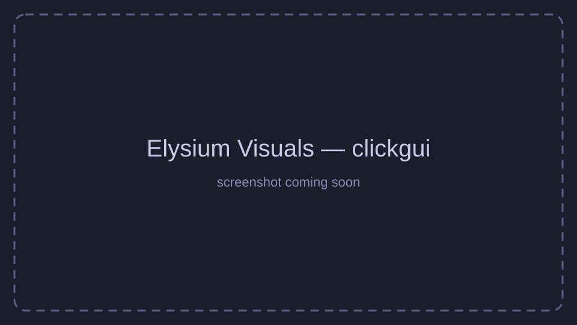
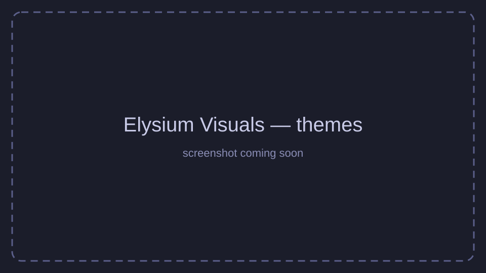
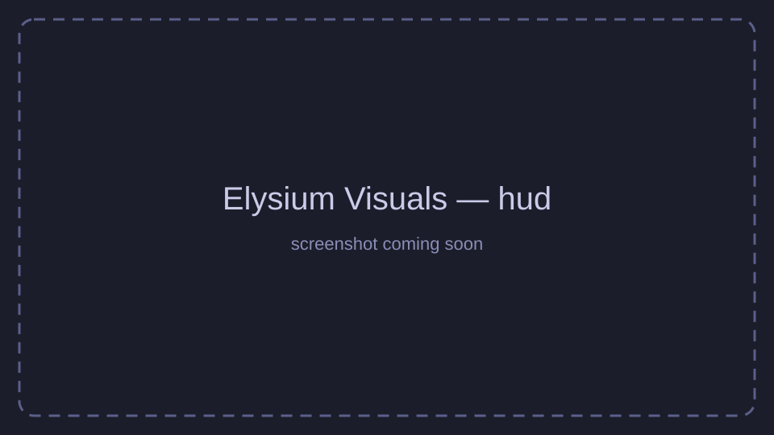
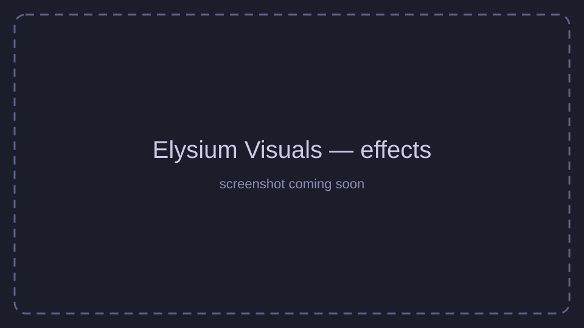

# Elysium Visuals

[](https://github.com/kirillyalovenko463-hash/elysium-visuals/actions/workflows/build.yml)
[](https://github.com/kirillyalovenko463-hash/elysium-visuals/releases/latest)

Клиентский визуальный мод для Minecraft на **Fabric**: ClickGUI с темами (включая Liquid Glass),
настраиваемый HUD и десятки визуальных и удобных модулей.  
## Скриншоты

> Скриншоты-заглушки — скоро будут заменены настоящими.

| ClickGUI | Темы |
|---|---|
|  |  |
| **HUD** | **Эффекты** |
|  |  |

## Возможности

- **ClickGUI** с поиском, анимациями и темами: Elysium, Тёмная, Светлая, Liquid Glass и своя тема с выбором цветов.
- **HUD**: ватермарка, таргет, бинды, эффекты, задержки, друзья, броня, координаты, информация о сервере и мире.
- **Render**: CustomSky, Ambience, Hands, TargetESP, Trail, JumpCircle, KillEffect, LootBeams, Particles,
  MotionBlur, Predictions, BlockOverlay, Crosshair, SwingAnimation, ViewModel, ShulkerPreview, NoRender,
  CustomPet, CustomCrystal, Optimizer, ChunkAnimator, FullBright, NoCameraClip и др.
- **Shaders** (Render): встроенные шейдеры — отражения, небо, объёмные облака, лучи света, AO, блум,
  тонмаппинг, автоэкспозиция, подводный туман, глубина резкости, хроматическая аберрация, резкость, мокрота;
  пресеты качества. С шейдерпаком Iris выключается сам.
- **Player**: AutoSprint, AutoTool, Armor HUD, Item Counter, Health Alert, NoFriendDamage, AutoEventGPS, PvPHelper.
- **Farm**: Loot Tracker, Session Timer, Tool Guard, Inventory Full, AutoCraft.
- **Utils**: друзья, уведомления, NameProtect, Death Point, ItemScroller, AutoAccept, FakePlayer, LockSlot,
  ChatHelper, DeathCoords, GPS (`.gps <x> <z>`), Zoom, BowOptimizer, CrystalOptimizer, RegionHelper и др.
- **Sodium** поддерживается: ChunkAnimator встраивается в шейдер терраина Sodium, остальное работает как есть.
- **Главное меню** в стиле лаунчера: 360°-панорамы (Лес, Река, Горы, Ночное небо, Закат), анимированный градиент
  и свои PNG/JPG из `config/elysium-visuals/backgrounds`. Модуль MainMenu возвращает ванильное меню.
- **Аккаунты**: офлайн и Microsoft, смена аккаунта без перезапуска, общий список с Elysium Launcher.
- **Мини-игра «Руда 2048»** в главном меню.
- **Конфиги** — сохранение и загрузка нескольких профилей настроек.
- **Punchy!** (необязательно): режим «Punchy» в SwingAnimation отдаёт анимации рук от первого лица моду
  [Punchy!](https://modrinth.com/mod/punchy-fpa) — его ставит Elysium Launcher. В других режимах и при выключенном
  модуле Punchy отключается, ViewModel работает поверх него.

## Установка

1. Установите [Fabric Loader](https://fabricmc.net/use/installer/) **0.19.5+** для Minecraft **26.2**.
2. Скачайте [Fabric API](https://modrinth.com/mod/fabric-api) для 26.2 и положите в папку `mods`.
3. Скачайте `elysium-visuals-<версия>.jar` со страницы [Releases](https://github.com/kirillyalovenko463-hash/elysium-visuals/releases/latest)
   (не `-sources.jar`) и положите в папку `mods`:
   - Windows: `%APPDATA%\.minecraft\mods`
   - macOS: `~/Library/Application Support/minecraft/mods`
   - Linux: `~/.minecraft/mods`
4. Запустите игру с профилем Fabric. Нужна **Java 25+**.
5. Необязательно: [Punchy!](https://modrinth.com/mod/punchy-fpa) для режима «Punchy» в SwingAnimation.

## Использование

- **Правый Shift** — открыть ClickGUI (клавишу можно сменить в «Настройки → Управление»).
- Команды в чате (префикс `.`):

| Команда | Описание |
|---|---|
| `.help` | список команд |
| `.cfg <save\|load\|remove\|reset\|list> [имя]` | управление конфигами |
| `.friend <add\|remove\|list> [ник]` | список друзей |
| `.fakeplayer <spawn\|remove>` | локальная копия игрока для проверки эффектов |
| `.gps <x> <z>`, `.gps off` | метка GPS: стрелка с расстоянием и столб света |
| `.blacklist <add\|remove\|list> [ник]` | чёрный список чата (PvPHelper) |
| `.panic` | полностью скрыть клиент до перезапуска игры |

## Сборка из исходников

```sh
./gradlew build
```

Готовый мод появится в `build/libs/`. Нужен JDK 25.

## Релизы

Релизы собираются автоматически GitHub Actions: достаточно запушить тег вида `vX.Y.Z`:

```sh
git tag v1.0.1
git push origin v1.0.1
```

Версия мода берётся из имени тега.

## Моды по умолчанию в лаунчере

[`default-mods.json`](default-mods.json) — список модов, которые Elysium Launcher ставит вместе с клиентом.
Для каждого мода указаны ID проекта и версии на [Modrinth](https://modrinth.com) (Fabric, 26.2);
лаунчер скачивает файлы только через Modrinth API и проверяет sha512, зависимости подтягивает сам
(Fabric API ставится лаунчером отдельно). Чтобы обновить мод, замените `version` на ID новой версии
и запушьте в `main` — лаунчер заменит файл при следующем запуске. `"required": false` — мод можно
выключить во вкладке «Моды».

## Лицензия

[CC0 1.0](LICENSE). Шрифт Inter распространяется под [SIL Open Font License](src/client/resources/assets/elysium-visuals/font/inter-ofl.txt).
Панорамы главного меню — фото с [Poly Haven](https://polyhaven.com) (CC0).
